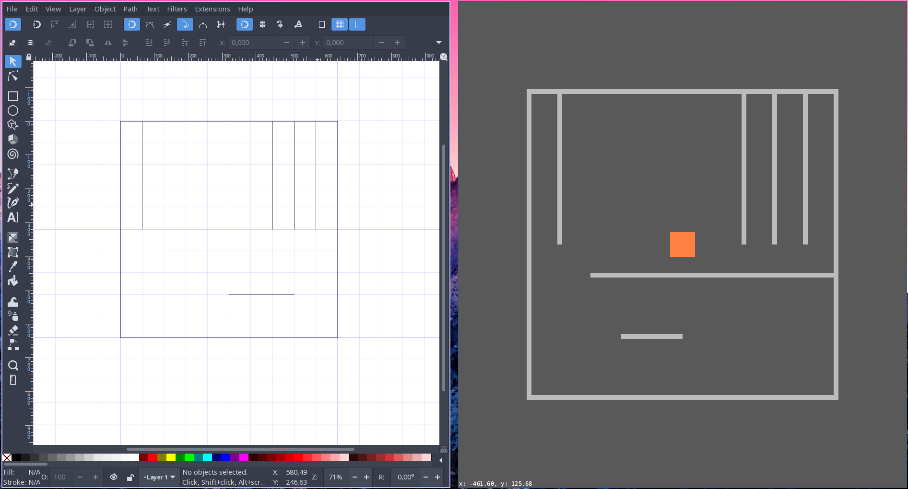

# Bevy SVG map

[](https://crates.io/crates/bevy_svg_map/)
[](https://docs.rs/bevy_svg_map)

Crate for loading SVG files into bevy:
* Load paths from an SVG directly into [bevy](https://github.com/bevyengine/bevy/).
The properties of the lines (color, opacity, fill...) can be used to programmatically
add functionality, setting the foundation for a very weird workflow: Vector Graphics as editor to bevy entities!
* Load whole SVG files as a single entity (see [this example](#load-a-whole-svg-file-as-an-entity)).


## Getting started
Add the library to your project's `Cargo.toml` (check last published version,
it corresponds to the stable version on the branch [`crates.io`](https://github.com/carrascomj/bevy_svg_map/tree/crates-io)):
```toml
[dependencies]
bevy_svg_map = "0.1"
```
If you want the bleeding edge (corresponds to [`master`](https://github.com/carrascomj/bevy_svg_map/tree/master/)):
```toml
[dependencies]
bevy_svg_map = {git="https://github.com/carrascomj/bevy_svg_map.git"}
```
> :warning: The master branch points to each master branch of **bevy** and [**lyon**](https://github.com/nical/lyon). Use with caution!

The library provides a function to be used inside a bevy's startup_system.
Here, we are loading the file `ex.svg` under the `assets/` directory.

```rust
use bevy_svg_map::load_svg_map;
use bevy::prelude::*;

// We need to provide a struct implementing the StyleStrategy
// leave it as default, we'll come back to this later
struct MyStrategy;

impl StyleStrategy for MyStrategy {}

fn main() {
    App::build()
          .add_default_plugins()
          .add_startup_system(setup.system())
          .run();
}

fn setup(com: Commands, mat: ResMut<Assets<ColorMaterial>>, mesh: ResMut<Assets<Mesh>>) {
    load_svg_map(com, mat, mesh, "assets/ex.svg", MyStrategy);
}
```
That should display some lines as in the image on the top. However, they are plain
black (default for `StyleStrategy`). What about using the colors from the SVG
path strokes?
```rust
// we're now also using SvgStyle
use bevy_svg_map::{load_svg_map, StyleStrategy, SvgStyle};
use bevy::prelude::*;

struct MyStrategy;

impl StyleStrategy for MyStrategy {
  // implement this trait method
  fn color_decider(&self, style: &SvgStyle) -> Color {
        match style.stroke() {
            Some(c) => c,
            // add red lines if the Color could not be parsed from the SVG
            _ => Color::RED,
        }
    }
}
```
OK, that's a bit more interesting. Notice how `SvgStyle` exposes properties of the
style of the SVG path. For each of these paths, the `color_decider` function will be
applied to... well.. decide its color.

Finally, to provide some actually useful functionality, we can apply arbitrary functions
to each component created from the path.
```rust
// ... same as before

// This Component will be added to each SpriteComponents created from a path
enum Collider {
    Scorable,
    Solid,
}

impl StyleStrategy for MyStrategy {
  // implement this trait method
  fn color_decider(&self, style: &SvgStyle) -> Color {
        // same as before
  }
  fn component_decider(&self, style: &SvgStyle, comp: &mut Commands) {
    // use the stroke opacity to decide the kind of Collider
      comp.with(
          if style.stroke_opacity().unwrap() == 1.0 {
              Collider::Solid
          } else{
              Collider::Scorable
          }
      );
  }
}
```

Check out more properties to extract from `SvgStyle` in the documentation!

### Load a whole SVG file as an entity
Plug and play!
```rust
use bevy_svg_map::load_svg;

fn setup_whole_svg(
    commands: Commands,
    materials: ResMut<Assets<ColorMaterial>>,
    meshes: ResMut<Assets<Mesh>>,
) {
    load_svg(commands, materials, meshes, "assets/ex.svg", 1., 2.);
}
```
The function returns a command so you can chain components.
```rust
  load_svg(commands, materials, meshes, "assets/ex.svg", 1., 2.).
    with(YourComponent)
    // etc
```


## Troubleshooting
* Set up your Document Properties (in Inkscape _Ctrl+Shift+D_) to pixels so that you get the right world units.
* See [this comment](https://github.com/carrascomj/bevy_svg_map/issues/1#issuecomment-706611397) about setting SVG output.

## Features
* [x] Load Horizontal and Vertical lines.
* [x] Load other types of [svgtypes](https://github.com/RazrFalcon/svgtypes) [`PathSegment`s]().
* [x] Provide a [strategy](https://en.wikipedia.org/wiki/Strategy_pattern) trait
to use the style to add Components and materials.
* [ ] Basic shapes.
* [ ] Handling of units.
