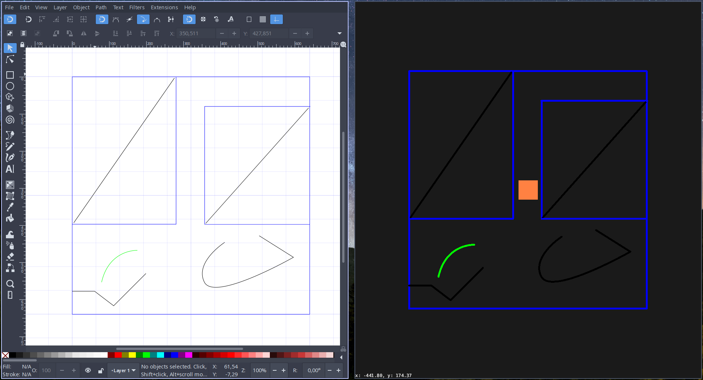

# Bevy SVG map

[](https://crates.io/crates/bevy_svg_map/)
[](https://docs.rs/bevy_svg_map)

Load paths from an SVG directly into [bevy](https://github.com/bevyengine/bevy/).


## Getting started
Add the library to your project's `Cargo.toml` (check last published version):
```toml
[dependencies]
bevy_svg_map = "0.1"
```

The library provides a function to be used inside a bevy's startup_system.
 Here, we are loading the file `ex.svg` under the `assets/` directory.

```rust
use bevy_svg_map::load_svg_map;

use bevy::app::App;
use bevy::prelude::*;
use bevy::AddDefaultPlugins;

struct TestPlugin;
impl Plugin for TestPlugin {
    fn build(&self, app: &mut AppBuilder) {
        app.add_startup_system(setup.system());
    }
}

fn main() {
    App::build().add_default_plugins().add_plugin(TestPlugin).run();
}

fn setup(commands: Commands, materials: ResMut<Assets<ColorMaterial>>) {
    load_svg_map(commands, "assets/ex.svg", materials);
}
```

## Troubleshooting
Set up your Document Properties (in Inkscape _Ctrl+Shift+D_) to pixels so that you get the right world units.

## Features
* [x] Load Horizontal and Vertical lines.
* [ ] Load other types of [svgtypes](https://github.com/RazrFalcon/svgtypes) `PathSegment`s.
* [ ] Provide a [strategy](https://en.wikipedia.org/wiki/Strategy_pattern) trait
to use the style to add Components and materials.
* [ ] Handling of units.
